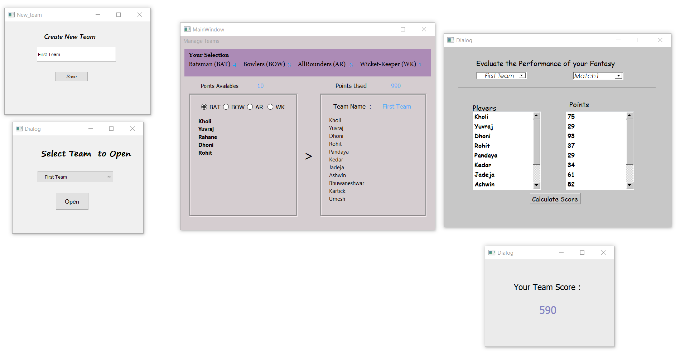

# Cricket_Fantasy_Game
It is an online game where you create a virtual team of real cricket players and score points depending on how your chosen players perform in real-life matches.Graphic user Interface (GUI) of this online game application is developed by the use of PyQT, SQLite Database is used to make this Application more dynamic, Python Programming language as well as Concepts of OOPs, are extensively used to build Logic of this Application. Command-line Interface (CLI) is used to convert .ui and .db file to .py file.
# Development Tools
1) Visual Studio Code
2) SQLite Studio
3) QT Designer
4) Python IDLE

# Cricket_Fantasy_Game Preview
<br>


# Guideline to Get Started

1. On the [GitHub page for this repository](https://github.com/zero-to-mastery/start-here-guidelines), click on the Button "Fork".

   

2. Clone _your forked repository_ to your computer:

   

    For example, run this command inside your terminal:

    ```bash
    git clone git@github.com:<your-github-username>/Cricket_Fantasy_Game.git
    ```

    **Replace \<your-github-username\>!**
3. Before you make any changes, [keep your fork in sync](https://www.freecodecamp.org/news/how-to-sync-your-fork-with-the-original-git-repository/) to avoid merge conflicts:

    ```bash
    git remote add upstream git@github.com:<your-github-username>/Cricket_Fantasy_Game.git
    git pull upstream master
    ```
4. Add the changes with `git add`, `git commit` ([write a good commit message](https://chris.beams.io/posts/git-commit/), if possible):

    ```bash
    git add .
    git commit -m "Add good commit message"
    ```

    **Replace \<your-github-username\>!**

5. Push your changes _to your repository_:

    ```bash
    git push origin master
    ```

6. Go to the GitHub page of _your fork_, and make a pull request:

    

    Read more about pull requests on the [GitHub help pages](https://help.github.com/en/github/collaborating-with-issues-and-pull-requests/creating-a-pull-request).

**Happy Learning 😄**
